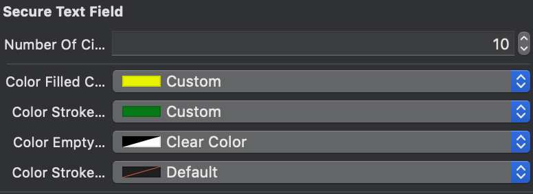

# SecureTextField
A beautiful TextField with hides the password and enforce good password policies. Written  in Objective-C
 
 

 
 # :star: Features
 
 * Custom bottom line in IB or programmatically.
 * Custom circle width/height in IB or programmatically.
 * Custom circle fill/empty/border color in IB or programmatically.
 * Set number of circle  in IB or programmatically.
 
 
 :octocat: Installation
 
 1 - Download and drop /SecureTextField folder in your project.
 2 -  #import "SecureTextField.h"
 3 - Extend textfield from SecureTextField
 4 - Create new SecureTextField 
 5 - Set dynamic features
 6 - Congrats!
 
